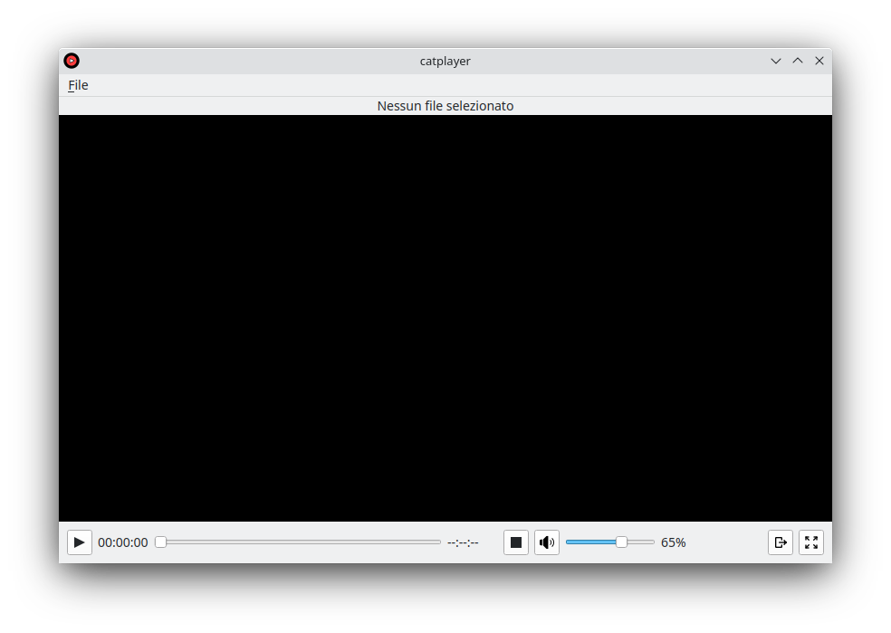

# catplayer

**catplayer** is a basic software for reproducing videos and music on Windows and Linux operating systems.
It is written in python with PySide6 and its developing has been a simple exercise for practising on the use of PySide6.

## How to use it
### On Windows

#### Requirements:

    1. Windows 11
    2. Python 3.10 installed

#### Step by step through installation

Open PowerShell and run the commands:

        git clone https://github.com/mcatillo/catplayer.git
        cd catplayer/
        python3.10 -m venv .menv
        .\.menv\Scripts\Activate.ps1
        pip install -r requirements_win.txt

after that you can run the application, with the command:

    python cli.py
and the application will start.

#### Create .exe file

After the previous installation steps, in order to create a `.exe` file do not close
PowerShell, and just run on it the command:

        pyinstaller --noconsole --onefile --distpath="." --name=catplayer --icon=logo/catplayer_128x128.ico cli.py
It will generate the executable `catplayer.exe`, which you can click to start the application.
Now you can close PowerShell.

### On Linux

#### Requirements:

    1. Ubuntu 20.04 or above
    2. Python 3.10 installed

#### Step by step through installation

##### Global installation

For a global installation on you system,
open your terminal and launch the commands:

        git clone https://github.com/mcatillo/catplayer.git
        cd catplayer/
        sudo bash scripts/catplayerLinuxInstall.sh
after that the application is available globally in your system.

#### Running with python

For just installing and running the application through python via terminal,
open your terminal and launch the commands:

        git clone ...
        cd catplayer/
        python3.10 -m venv .menv
        source .menv/bin/activate
        pip install -r requirements_lin.txt
after that you can run the application, with the command:

        python cli.py
and the application will start.
For creating the executable you can run:

        pyinstaller --noconsole --onefile --distpath="." --name=catplayer --icon=logo/catplayer_128x128.ico cli.py

For opening a given file you can run instead:

    python cli.py -i <name video>.<format>
or

    ./catplayer -i <name video>.<format>

where `<format>` can be `mp4, mov, mp3, wav, mkv, avi, ...` depending by the formats supported by your system.

## License
The current software is currently distribuited under GPL license, version 3.

## Contact
For information, problems or issues about this software that you want to report, you can contact me at the email address: <catillo.software@gmail.com>.

## Final Notes
This software has to be intended as still in the production process. It is not yet a finished product and further improvements will be added in the next versions.
